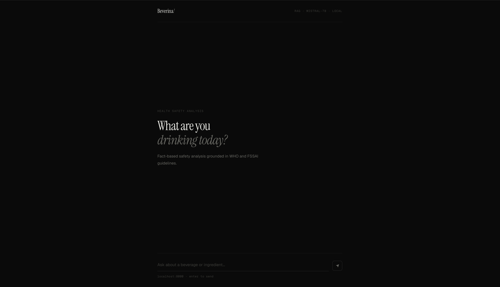
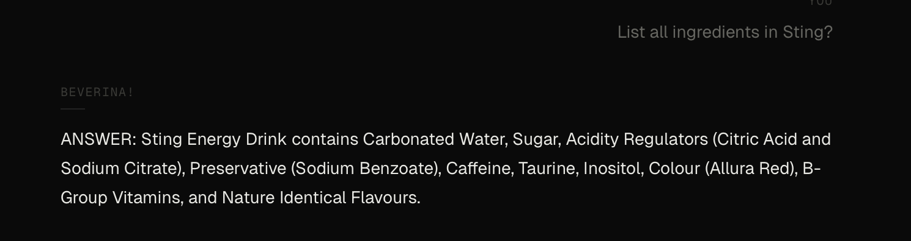
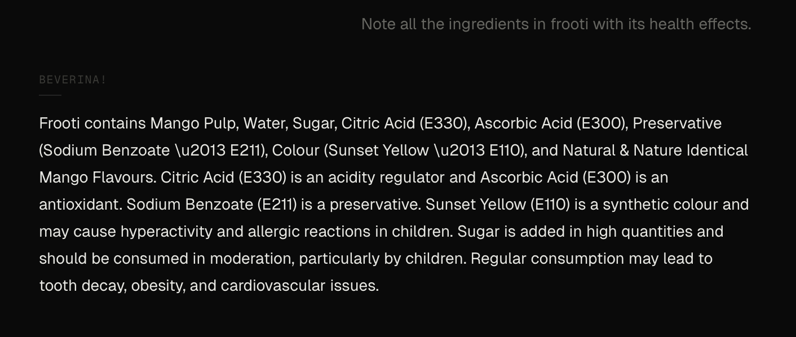
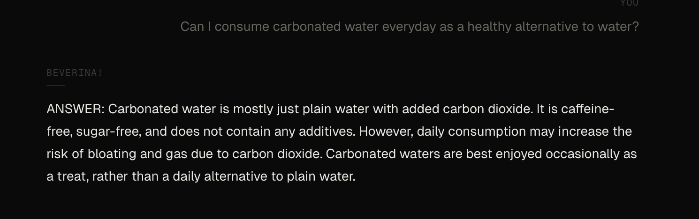

# 🧠 Beverina — AI-Powered Ingredient Safety Analyzer

End-to-end LLM system for analyzing beverage ingredient safety using **RAG, FAISS, and LoRA**, deployed with fully local GGUF inference.

---

## 🔍 Overview

Beverina analyzes beverages and ingredients using a **fine-tuned Mistral-7B model + Retrieval-Augmented Generation (RAG)**. It provides ingredient breakdowns, health impact insights, and regulatory-backed safety information (WHO, FSSAI, FDA), while minimizing hallucinations through controlled retrieval and prompt design.

---

## 🖥️ Demo

### 🧾 UI

### ⚡ Ingredient Breakdown

### 🧠 Health Analysis

### 💡 Reasoned Response

---

## ⚙️ Highlights

* RAG pipeline using **FAISS + MiniLM embeddings**
* **Mistral-7B-Instruct-v0.2** fine-tuned with **LoRA (rank 16, alpha 32)**
* Custom ingredient + product knowledge base
* Hallucination control via retrieval + system prompt
* **GGUF conversion + 4-bit quantization** for local inference
* Fully offline (no external APIs)

---

## 🔧 Pipeline

   Mistral-7B-Instruct-v0.2 (fp16)
        ↓
   LoRA Fine-tuning (rank=16, alpha=32, epochs=3)
        ↓
   Merge LoRA adapter into base model
        ↓
   Convert merged model → GGUF format
        ↓
   Q4_K_M quantization via llama.cpp
        ↓
   Local inference via llama-cpp-python + FastAPI

---

## ⚠️ Note

Model weights are not included due to size. Reproduce via training and conversion scripts.

---
